# SimpleClassification-CreateML-CoreML
Create ML로 나만의 Classifier 모델을 만들고 Core ML로 앱에서 사용해보는 End-to-End 예제 프로젝트입니다. 

## 들어가며

다음 그림은 모바일 기기 위에 머신러닝을 올리는 절차를 표현한 다이어그램이다. 크게 세 단계(학습, 변환, 추론)로 나눠지며, 이 저장소에서는 Create ML을 활용하여 모델을 만들고 Core ML을 활용하여 모바일 위에서 머신러닝을 사용해 봅니다.

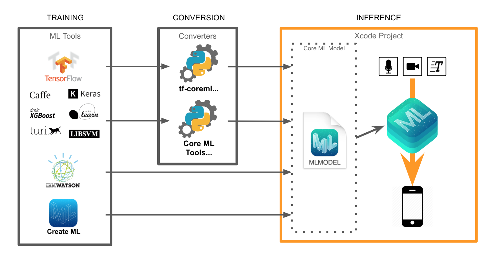

## 머신러닝 프로젝트

#### 1. 모바일 프로젝트 생성

최종적으로 모바일용 Classification 앱을 만들기위해 모바일 프로젝트를 생성합니다.

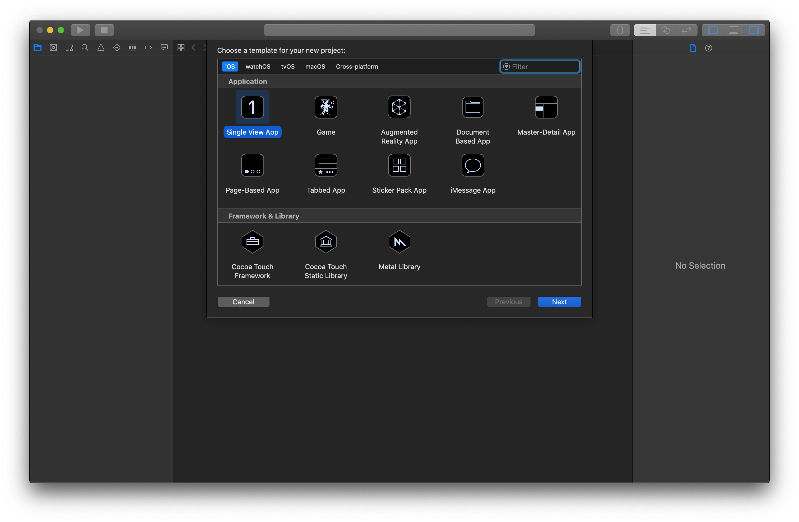

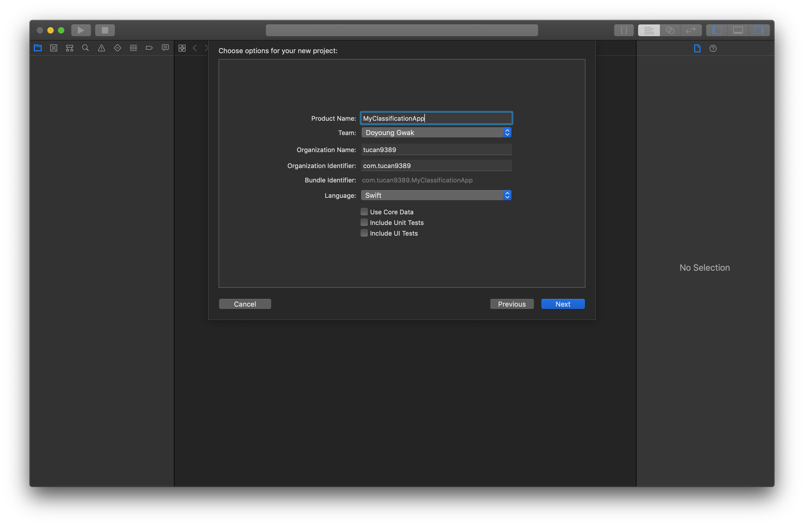

### 2. TrainingPlayground 생성

모바일 프로젝트(`MyClassificationApp`)에서 `File > New > Playground...` 를 선택합니다.<br>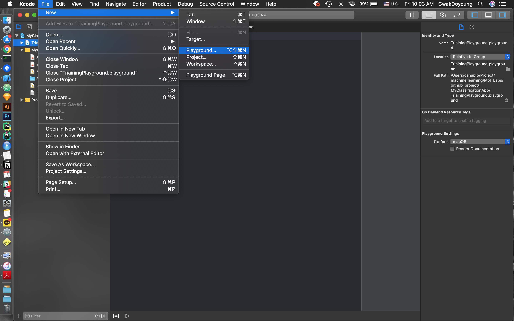


여기서 주의할 점은 macOS 플랫폼을 선택하고 플레이그라운드를 만들어줘야 CreateML을 사용할 수 있습니다!<br>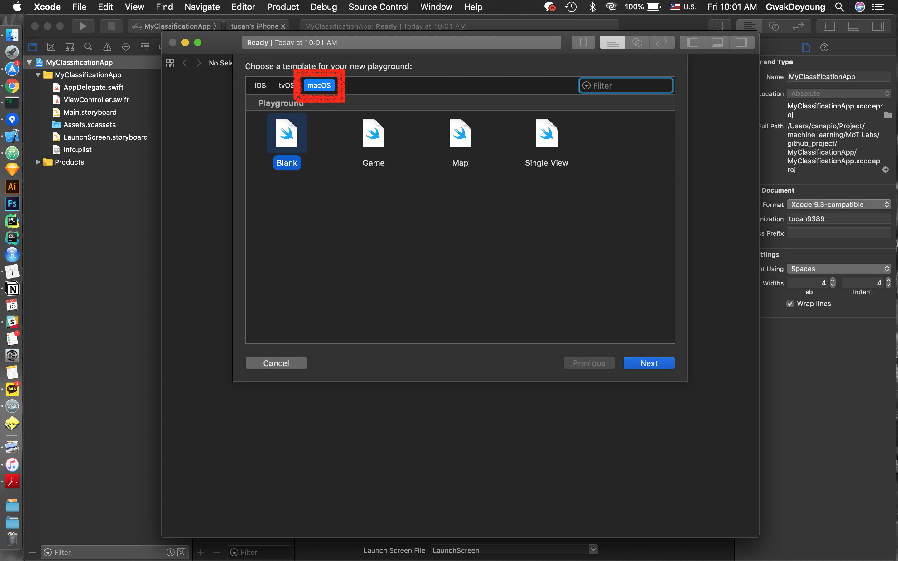

플레이그라운드를 어느 프로젝트와 어느 그룹에 넣을지 정합니다. 여기서는 `MyClassificationApp` 프로젝트에 추가하며, 이렇게 해야 모바일 프로젝트 안에 플레이그라운드 파일이 생성됩니다.<br>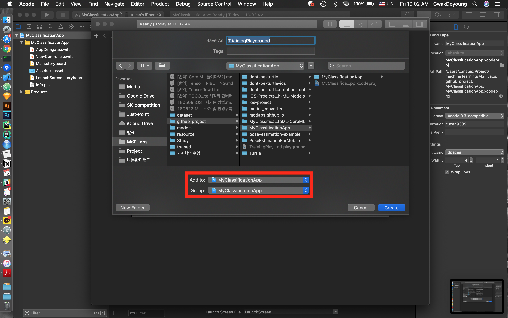

플레이그라운드가 모바일 프로젝트 안에 만들어졌음을 확인할 수 있습니다. 이제 Create ML 코드는 이 파일 안에 작성하면 됩니다.<br>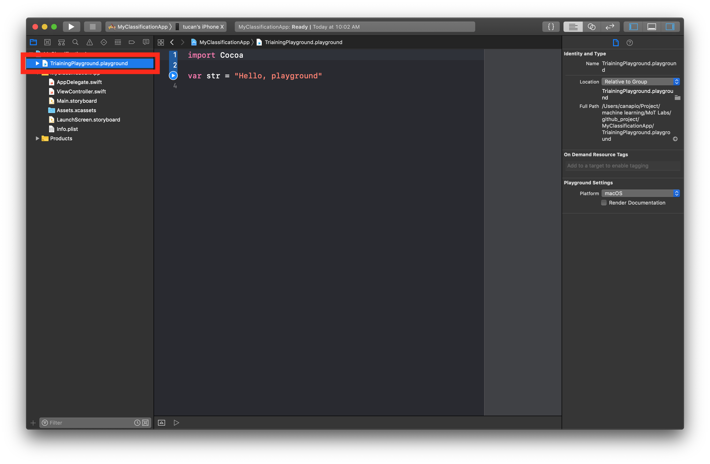

### 3. Create ML 코드 작성

다음 코드를 넣고 ①의 실행 버튼을 누르면 Assistant Editor에 ②처럼 ClassificatierBuilder가 만들어집니다. Assistant Editor는 ③을 클릭하면 나타납니다.

```swift
import CreateMLUI

let builder = MLImageClassifierBuilder()
builder.showInLiveView()
```

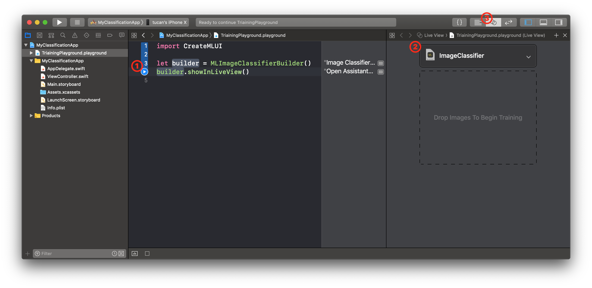

### 4. 데이터셋 수집

구글에 있는 아두이노와 모듈 사진을 종류별로 30개씩 준비했습니다.

저는 파이썬 라이브러리인 [hardikvasa/google-images-download](https://github.com/hardikvasa/google-images-download)을 사용하여 구글로부터 데이터셋을 수집했습니다. 

```shell
# install google-images-download
$ pip install google_images_download

$ cd ~/Desktop
# download 30 images searched on google with "arduino" 
$ googleimagesdownload -k "arduino" -l 30
$ googleimagesdownload -k "breadboard" -l 30
$ googleimagesdownload -k "motor" -l 30
$ googleimagesdownload -k "resistor" -l 30
...
```

`google-images-download`를 사용해 구글의 이미지를 다운받으면 아래와같이 검색 키워드에대한 폴더가 생기고, 해당 폴더 안에 이미지가 다운로드 됩니다.

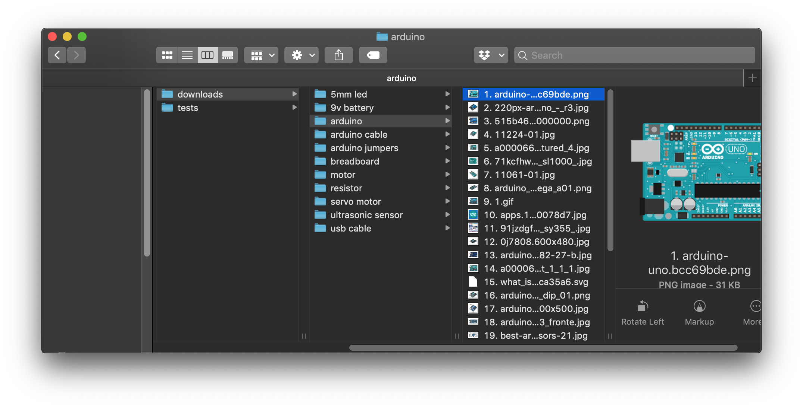

### 5. 학습

다운로드 받았던 데이터셋을 Xcode에 드래그 & 드롭합니다.<br>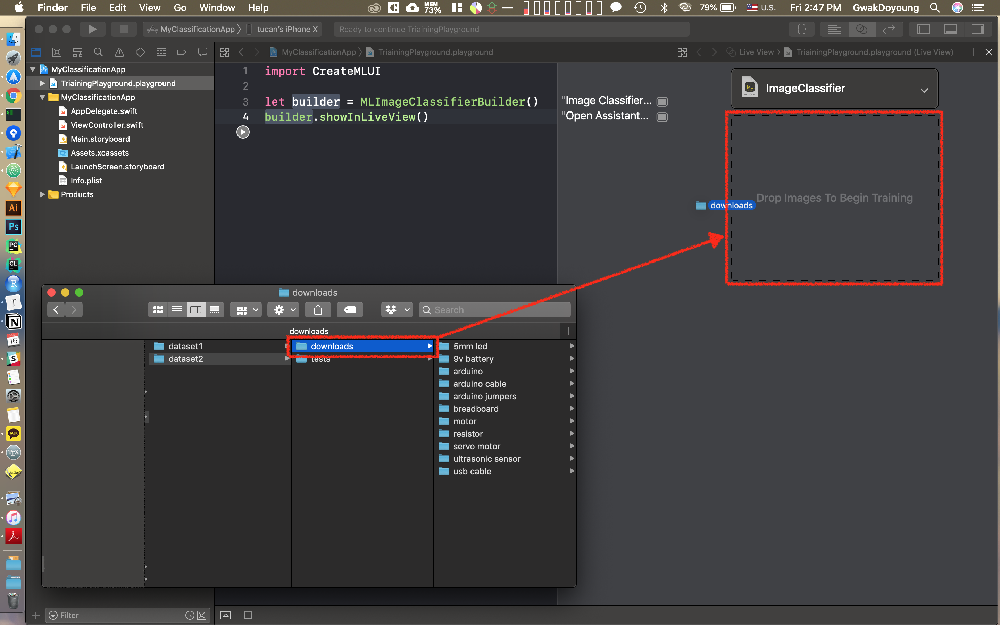

드롭을 하는 순간 Xcode는 학습을 시작합니다.<br>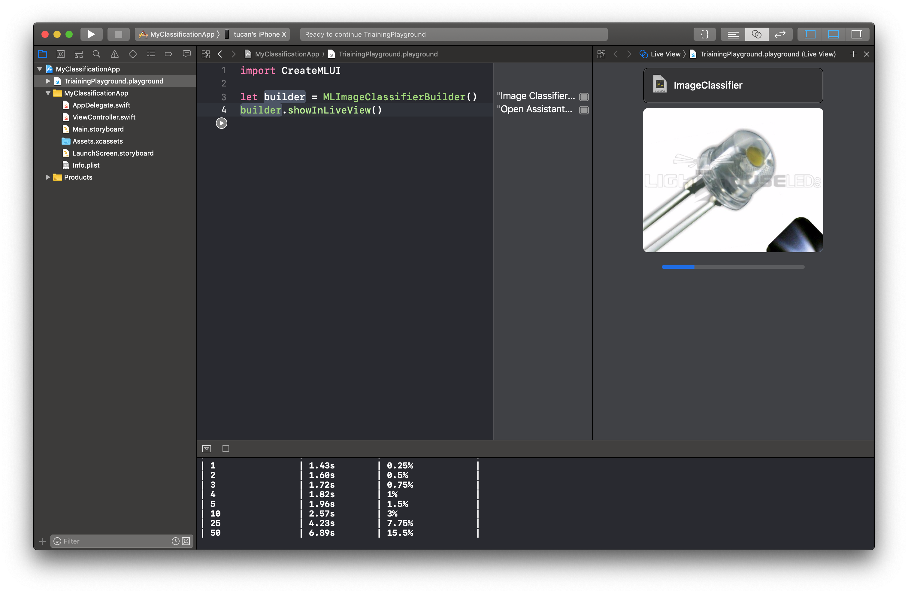

학습이 끝나면 학습데이터와 검증 데이터에대한 모델의 accuracy를 알려줍니다. 아래의 경우는 학습 데이터에대해서는 93%와 검증 데이터에대해서는 94%의 결과를 나타냅니다. <br>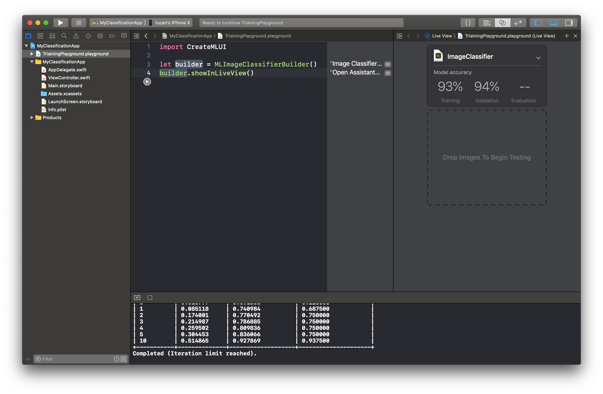

### 6. 평가

이번에는 직접 찍은 아두이노 사진을 테스트 데이터셋으로 넣어서 accuracy를 확인합니다.<br>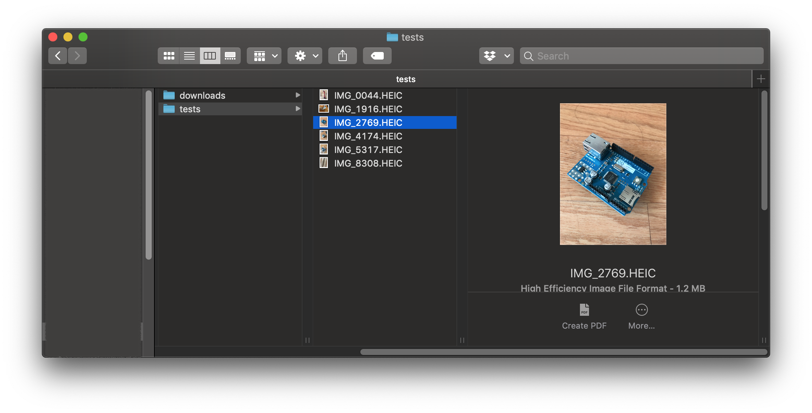

학습때와 마찬가지로 테스트 데이터셋 폴더를 Xcode에 드래그 & 드롭합니다<br>

드롭을 하는 순간 테스트 데이터셋 폴더 안에 있는 이미지를 추론한 결과를 보여줍니다. <br>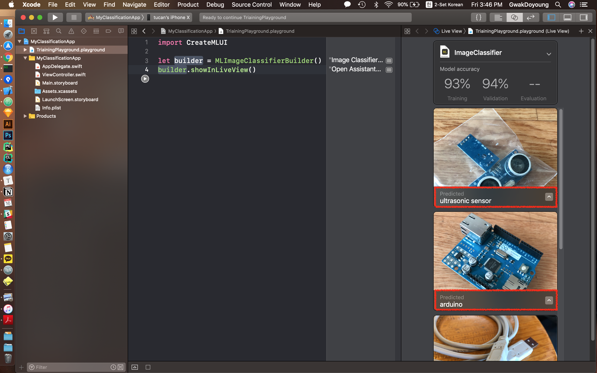

### 7. 내보내기

아래 스크린샷처럼 Core ML용 모델 아이콘을 모바일 프로젝트에 넣거나 다른 폴더에 저장할 수 있습니다.<br>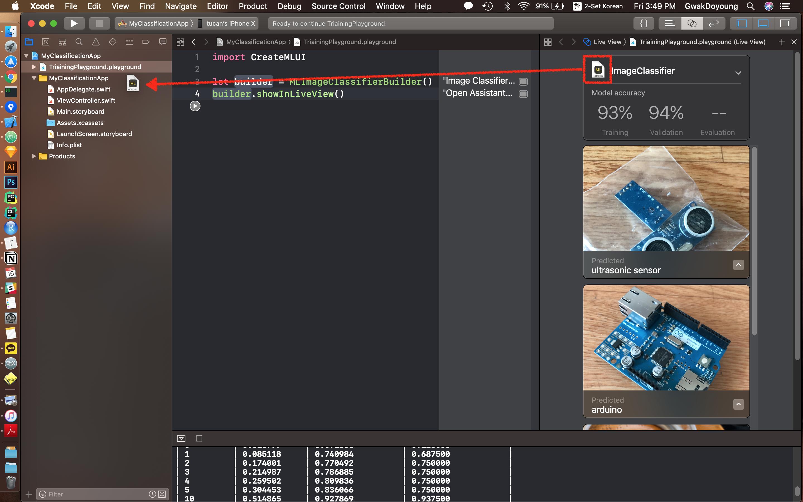

여기까지가 모바일 머신러닝에서 학습과 변환단계였습니다. 다음으로는 만들어진 모델을 사용하여 추론하는 간단한 모바일 앱을 만들어보도록 하겠습니다.

## 모바일 프로젝트

### 1. 모델 정보 확인

Create ML에서 만든 Core ML 모델을 Xcode에서 열어보면 다음 화면이 나타납니다(①). 이번에 만든 Classification 모델 크기는 165 KB(②), 소스코드상에서 모델을 불러올때는 `ImageClassifier` 클래스를 통해 불러옵니다(③). 이 모델의 입력 포맷은 299Ｘ299 컬러 이미지이며, 출력 포맷에는 카테고리별 확률이 들어간 Dictionary와 가장 높은 확률의 카테고리 이름이 있습니다(④).

모델을 Xcode 프로젝트에 넣으면 자동으로 모델 이름의 클래스를 만들어 줍니다.  모델 이름의 클래스를 호출하여 코드상에서 모델을 사용할 수 있습니다.

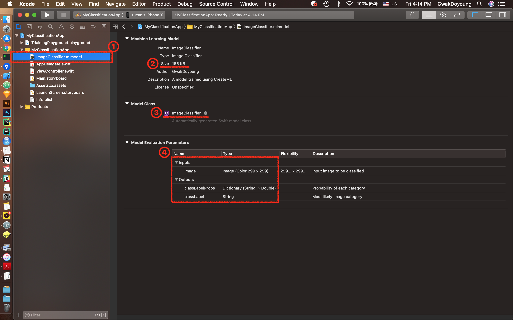

### 2. 추론

앞에서 추가했던 모델(`ImageClassifier`)을 인스턴스로 생성하고, `prediction` 메소드를 호출하여 결과를 받아냅니다.

```swift
import Vision

// create model
let model = ImageClassifier()

// predict
if let result = try? model.prediction(image: pixelBuffer) {
    let predictedLabel = result.classLabel
    let confidence = result.classLabelProbs[result.classLabel] ?? 0.0
    label.text = "\(predictedLabel), \(confidence)"
}
```

### 3. 모바일 앱 결과


## See Also

- [Machine Learning - Apple Developer](https://developer.apple.com/machine-learning/)
- [Create ML | Apple Developer Documentation](https://developer.apple.com/documentation/createml)
- [Core ML | Apple Developer Documentation](https://developer.apple.com/documentation/coreml)
- WWDC17 - Core ML 발표자료 
  - [WWDC17 703 Session - Introducing Core ML](https://developer.apple.com/videos/play/wwdc2017/703/)
  - [WWDC17 710 Session - Core ML in depth](https://developer.apple.com/videos/play/wwdc2017/710/)
  - [WWDC17 506 Session - Vision Framework: Building on Core ML](https://developer.apple.com/videos/play/wwdc2017/506)
  - [WWDC17 208 Session - Natural Language Processing and your Apps](https://developer.apple.com/videos/play/wwdc2017/208)
- WWDC18 - Core ML 2 발표자료
  - [WWDC18 703 Session - Introducing Create ML](https://developer.apple.com/videos/play/wwdc2018/703)
  - [WWDC18 708 Session - What’s New in Core ML, Part 1](https://developer.apple.com/videos/play/wwdc2018/708/)
  - [WWDC18 709 Session - What’s New in Core ML, Part 2](https://developer.apple.com/videos/play/wwdc2018/709/)
  - [WWDC18 717 Session - Vision with Core ML](https://developer.apple.com/videos/play/wwdc2018/717/)
  - [WWDC18 713 Session - Introducing Natural Language Framework](https://developer.apple.com/videos/play/wwdc2018/713)
  - [WWDC18 712 Session - A Guide to Turi Create](https://developer.apple.com/videos/play/wwdc2018/712)
- [오픈세미나 - Machine Learning with Apple 슬라이드 자료](https://docs.google.com/presentation/d/1zbcwGroZoj7bRuTQKGcE-4PJbhSomtkJK0xov2C_HsE/edit?usp=sharing)
- [MoTLabs Blog](https://motlabs.github.io/)
